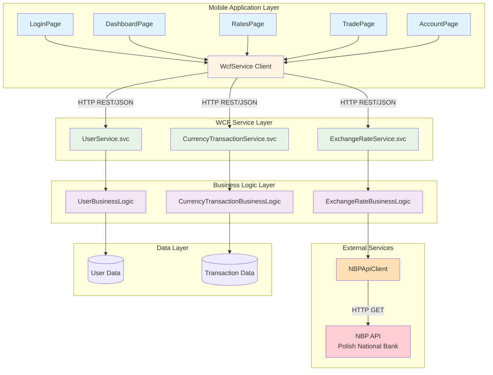
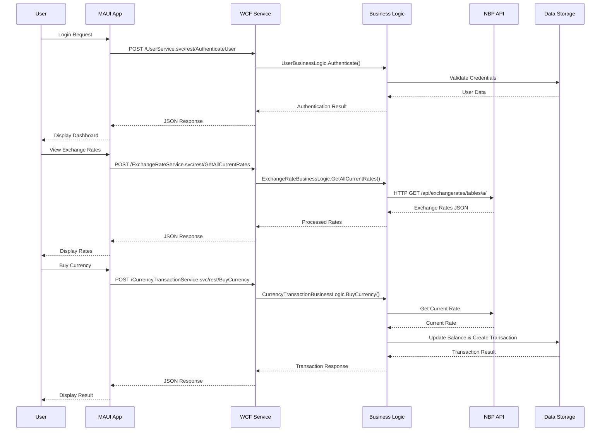

# Currency Exchange Application

A full-stack currency exchange application consisting of a WCF (Windows Communication Foundation) backend service and a .NET MAUI mobile application. The system allows users to view real-time exchange rates, manage accounts, and perform currency buy/sell transactions.

## 📋 Table of Contents

- [Overview](#overview)
- [Architecture](#architecture)
- [Project Structure](#project-structure)
- [Features](#features)
- [Technologies](#technologies)
- [Prerequisites](#prerequisites)
- [Getting Started](#getting-started)
- [API Endpoints](#api-endpoints)
- [Configuration](#configuration)
- [Project Diagram](#project-diagram)

## 🎯 Overview

This application provides a complete currency exchange platform with:

- **Backend**: WCF service that exposes REST and SOAP endpoints for currency operations
- **Frontend**: Cross-platform MAUI mobile application (Android, iOS, Windows, macOS)
- **External Integration**: Polish National Bank (NBP) API for real-time exchange rates
- **Core Functionality**: User authentication, account management, exchange rate viewing, and currency trading

## 🏗️ Architecture

The application follows a layered architecture:

```
┌─────────────────────────────────────────────────────────────┐
│                    MAUI Mobile Application                    │
│              (CurrencyExchangeMobile)                         │
│  ┌──────────┐  ┌──────────┐  ┌──────────┐  ┌──────────┐    │
│  │ Login    │  │Dashboard │  │  Rates   │  │  Trade   │    │
│  │  Page    │  │  Page    │  │  Page    │  │  Page    │    │
│  └──────────┘  └──────────┘  └──────────┘  └──────────┘    │
│                          │                                    │
│                    ┌─────▼─────┐                             │
│                    │WcfService │                             │
│                    │  Client   │                             │
│                    └─────┬─────┘                             │
└──────────────────────────┼────────────────────────────────────┘
                           │ HTTP/REST
                           │
┌──────────────────────────▼────────────────────────────────────┐
│              WCF Service (SamiKaanWCF)                        │
│  ┌──────────────────────────────────────────────────────┐   │
│  │              Service Layer                            │   │
│  │  ┌──────────────┐  ┌──────────────┐  ┌──────────┐  │   │
│  │  │   User       │  │   Exchange   │  │ Currency │  │   │
│  │  │  Service     │  │   Rate       │  │Transaction│  │   │
│  │  │              │  │   Service    │  │  Service │  │   │
│  │  └──────┬───────┘  └──────┬───────┘  └────┬─────┘  │   │
│  └─────────┼──────────────────┼───────────────┼────────┘   │
│            │                  │               │             │
│  ┌─────────▼──────────────────▼───────────────▼────────┐   │
│  │            Business Logic Layer                      │   │
│  │  ┌──────────────┐  ┌──────────────┐  ┌──────────┐  │   │
│  │  │   User       │  │   Exchange   │  │ Currency │  │   │
│  │  │  Business    │  │   Rate       │  │Transaction│  │   │
│  │  │  Logic       │  │   Business   │  │ Business │  │   │
│  │  └──────────────┘  └──────┬───────┘  └──────────┘  │   │
│  └────────────────────────────┼─────────────────────────┘   │
│                               │                             │
│                    ┌──────────▼──────────┐                 │
│                    │   NBPApiClient      │                 │
│                    │  (External API)     │                 │
│                    └──────────┬──────────┘                 │
└───────────────────────────────┼─────────────────────────────┘
                                │
                    ┌───────────▼───────────┐
                    │   NBP API             │
                    │  (Polish National    │
                    │   Bank)              │
                    └──────────────────────┘
```

## 📁 Project Structure

```
SamiKaanWCF/
├── CurrencyExchangeMobile/          # MAUI Mobile Application
│   ├── Views/                       # UI Pages
│   │   ├── LoginPage.xaml          # User authentication
│   │   ├── DashboardPage.xaml       # Main dashboard
│   │   ├── RatesPage.xaml          # Exchange rates display
│   │   ├── TradePage.xaml          # Currency trading
│   │   └── AccountPage.xaml        # Account management
│   ├── Services/
│   │   └── WcfService.cs           # WCF client service
│   ├── Platforms/                   # Platform-specific code
│   └── Resources/                   # Images, fonts, etc.
│
├── SamiKaanWCF/                     # WCF Backend Service
│   ├── Services/                    # WCF Service Implementations
│   │   ├── UserService.svc          # User management service
│   │   ├── ExchangeRateService.svc  # Exchange rate service
│   │   └── CurrencyTransactionService.svc # Trading service
│   ├── Business/                    # Business Logic Layer
│   │   ├── UserBusinessLogic.cs
│   │   ├── ExchangeRateBusinessLogic.cs
│   │   └── CurrencyTransactionBusinessLogic.cs
│   ├── Services/
│   │   └── NBPApiClient.cs         # NBP API integration
│   ├── Models/                      # Data Models
│   │   ├── UserModels.cs
│   │   ├── ExchangeRateResponse.cs
│   │   ├── TransactionModels.cs
│   │   └── NBPApiModels.cs
│   ├── Contracts/                   # Service Contracts
│   │   ├── IUserService.cs
│   │   └── ICurrencyTransactionService.cs
│   ├── IExchangeRateService.cs      # Exchange rate contract
│   └── Web.config                   # WCF configuration
│
└── packages/                        # NuGet packages
```

## ✨ Features

### User Management
- User registration and authentication
- Account balance management
- Account top-up functionality
- User profile management

### Exchange Rates
- Real-time exchange rate retrieval from NBP API
- Support for multiple currencies (USD, EUR, GBP, CHF, JPY, CAD, AUD, SEK, NOK, DKK, CZK, HUF, RUB, UAH)
- Historical exchange rate queries
- Current and historical rate display

### Currency Trading
- Buy currency transactions
- Sell currency transactions
- Price calculation (buy/sell)
- Transaction history
- Balance updates after transactions

### Mobile Application
- Cross-platform support (Android, iOS, Windows, macOS)
- Modern MAUI UI/UX
- Real-time data synchronization
- Offline error handling

## 🛠️ Technologies

### Backend
- **.NET Framework 4.7.2**: WCF service framework
- **WCF (Windows Communication Foundation)**: Service-oriented architecture
- **REST & SOAP**: Dual endpoint support
- **Newtonsoft.Json**: JSON serialization
- **System.Net.Http**: HTTP client for external API calls

### Frontend
- **.NET MAUI (.NET 9.0)**: Cross-platform mobile framework
- **XAML**: UI markup language
- **C#**: Primary programming language

### External Services
- **NBP API**: Polish National Bank exchange rate API
  - Base URL: `http://api.nbp.pl/api/exchangerates/`

## 📋 Prerequisites

- **Visual Studio 2022** (17.12 or later) with:
  - .NET MAUI workload
  - .NET Framework 4.7.2 targeting pack
  - ASP.NET and web development workload
- **.NET 9.0 SDK** (for MAUI application)
- **.NET Framework 4.7.2** (for WCF service)
- **IIS Express** or **IIS** (for hosting WCF service)
- **Internet connection** (for NBP API access)

## 🚀 Getting Started

### 1. Clone the Repository

```bash
git clone <repository-url>
cd SamiKaanWCF
```

### 2. Restore NuGet Packages

```bash
dotnet restore
```

Or use Visual Studio Package Manager Console:
```
Update-Package -reinstall
```

### 3. Configure WCF Service

1. Open `SamiKaanWCF.sln` in Visual Studio
2. Ensure the WCF service project is set as the startup project
3. Check `Web.config` for service endpoints configuration
4. Default service URL: `http://localhost:60729/`

### 4. Run WCF Service

1. Right-click on `SamiKaanWCF` project
2. Select "Set as StartUp Project"
3. Press F5 to run (IIS Express will start automatically)
4. Verify services are accessible at:
   - `http://localhost:60729/ExchangeRateService.svc`
   - `http://localhost:60729/UserService.svc`
   - `http://localhost:60729/CurrencyTransactionService.svc`

### 5. Configure Mobile Application

1. Open `CurrencyExchangeMobile` project
2. Update `WcfService.cs` base URL if needed:
   - Android Emulator: `http://10.0.2.2:60729`
   - Local machine: `http://localhost:60729`
   - Physical device: `http://<your-ip>:60729`

### 6. Run Mobile Application

1. Select target platform (Android, iOS, Windows, etc.)
2. Press F5 to build and run
3. The app will connect to the WCF service

## 🔌 API Endpoints

### User Service (`/UserService.svc/rest/`)

| Method | Endpoint | Description |
|--------|----------|-------------|
| POST | `CreateAccount` | Register new user |
| POST | `AuthenticateUser` | User login |
| POST | `TopUpAccount` | Add funds to account |
| POST | `GetUserBalance` | Get current balance |

### Exchange Rate Service (`/ExchangeRateService.svc/rest/`)

| Method | Endpoint | Description |
|--------|----------|-------------|
| POST | `GetCurrentRate` | Get rate for specific currency |
| POST | `GetAllCurrentRates` | Get all available rates |
| POST | `GetHistoricalRate` | Get historical rate for date |

### Currency Transaction Service (`/CurrencyTransactionService.svc/rest/`)

| Method | Endpoint | Description |
|--------|----------|-------------|
| POST | `CalculateBuyPrice` | Calculate buy price |
| POST | `CalculateSellPrice` | Calculate sell price |
| POST | `BuyCurrency` | Execute buy transaction |
| POST | `SellCurrency` | Execute sell transaction |

**Note**: All endpoints support both REST (JSON) and SOAP (XML) formats.

## ⚙️ Configuration

### WCF Service Configuration

Edit `SamiKaanWCF/Web.config` to modify:
- Service bindings and endpoints
- Timeout settings
- Message size limits
- Security settings

### Mobile App Configuration

Edit `CurrencyExchangeMobile/Services/WcfService.cs`:
- Base URL for different platforms
- Request timeout settings
- Error handling behavior

## 📊 Project Diagram

### Mermaid Architecture Diagram



### Request Flow Diagram



### System Architecture Flow

```
┌─────────────────────────────────────────────────────────────────┐
│                         USER INTERACTION                         │
└────────────────────────────┬──────────────────────────────────────┘
                             │
                             ▼
┌─────────────────────────────────────────────────────────────────┐
│                    MAUI MOBILE APPLICATION                       │
│  ┌──────────────────────────────────────────────────────────┐  │
│  │  Presentation Layer (XAML Views)                          │  │
│  │  • LoginPage    • DashboardPage                           │  │
│  │  • RatesPage    • TradePage    • AccountPage             │  │
│  └────────────────────┬───────────────────────────────────────┘  │
│                       │                                           │
│  ┌────────────────────▼───────────────────────────────────────┐  │
│  │  Service Layer (WcfService.cs)                            │  │
│  │  • HTTP Client                                             │  │
│  │  • JSON Serialization                                      │  │
│  │  • Error Handling                                          │  │
│  └────────────────────┬───────────────────────────────────────┘  │
└───────────────────────┼──────────────────────────────────────────┘
                        │ HTTP REST/JSON
                        │
┌───────────────────────▼──────────────────────────────────────────┐
│                    WCF SERVICE LAYER                              │
│  ┌──────────────────────────────────────────────────────────┐    │
│  │  Service Endpoints (REST + SOAP)                         │    │
│  │  • UserService.svc                                       │    │
│  │  • ExchangeRateService.svc                              │    │
│  │  • CurrencyTransactionService.svc                       │    │
│  └────────────────────┬───────────────────────────────────────┘    │
│                       │                                           │
│  ┌────────────────────▼───────────────────────────────────────┐  │
│  │  Business Logic Layer                                      │  │
│  │  • UserBusinessLogic                                       │  │
│  │  • ExchangeRateBusinessLogic                              │  │
│  │  • CurrencyTransactionBusinessLogic                        │  │
│  └────────────────────┬───────────────────────────────────────┘  │
│                       │                                           │
│  ┌────────────────────▼───────────────────────────────────────┐  │
│  │  Data Access & External Services                          │  │
│  │  • NBPApiClient (NBP API Integration)                      │  │
│  │  • User Data Storage                                       │  │
│  │  • Transaction Records                                     │  │
│  └────────────────────┬───────────────────────────────────────┘  │
└───────────────────────┼──────────────────────────────────────────┘
                        │
        ┌───────────────┴───────────────┐
        │                               │
        ▼                               ▼
┌───────────────┐            ┌──────────────────┐
│   NBP API     │            │  Data Storage    │
│ (External)    │            │  (In-Memory/DB)  │
└───────────────┘            └──────────────────┘
```

### Component Interaction Diagram

```
┌──────────────┐
│  MAUI App    │
│   (Client)   │
└──────┬───────┘
       │ HTTP POST (JSON)
       │
       ▼
┌─────────────────────────────────────┐
│  WCF Service Endpoint                │
│  (REST: /rest/ or SOAP: /)          │
└──────┬───────────────────────────────┘
       │
       ▼
┌─────────────────────────────────────┐
│  Service Implementation              │
│  (UserService/ExchangeRateService/   │
│   CurrencyTransactionService)        │
└──────┬───────────────────────────────┘
       │
       ▼
┌─────────────────────────────────────┐
│  Business Logic Layer                │
│  • Validation                        │
│  • Business Rules                    │
│  • Data Transformation               │
└──────┬───────────────────────────────┘
       │
       ├──────────────────┐
       │                  │
       ▼                  ▼
┌──────────────┐  ┌──────────────┐
│ NBPApiClient │  │ Data Models  │
│              │  │              │
│ • Get Rates  │  │ • User       │
│ • Historical │  │ • Transaction│
└──────┬───────┘  └──────────────┘
       │
       │ HTTP GET
       ▼
┌──────────────┐
│   NBP API    │
│  (External)  │
└──────────────┘
```

## 📝 Notes

- The WCF service runs on port **60729** by default (configurable in project properties)
- For Android emulator, use `10.0.2.2` instead of `localhost` to access host machine
- The service supports both REST (JSON) and SOAP (XML) endpoints
- Exchange rates are fetched from the Polish National Bank (NBP) API
- All transactions are processed in PLN (Polish Zloty) as the base currency

## 🔒 Security Considerations

- Currently configured for development (security mode: None)
- For production, implement:
  - HTTPS/TLS encryption
  - Authentication tokens
  - Input validation and sanitization
  - Rate limiting
  - SQL injection prevention (if database is added)

## 📄 License

[Specify your license here]

## 👥 Authors

[Add author information]

## 🤝 Contributing

[Add contribution guidelines if applicable]

